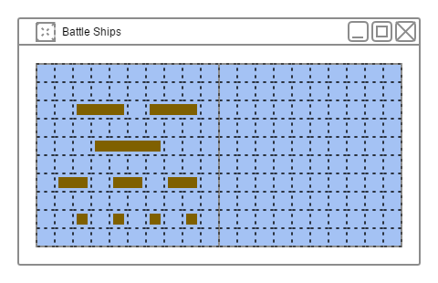
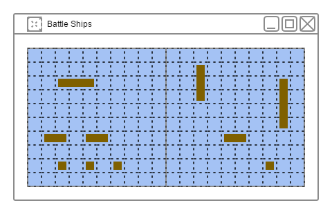
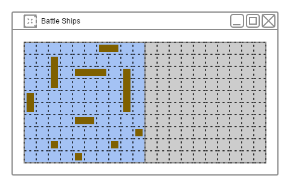
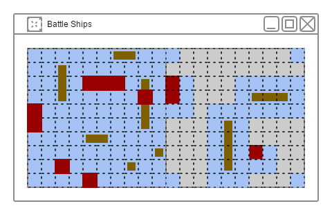

Раунд
=====

Весь раунд можно условно разбить на несколько этапов описанных ниже.
После подготовительного этапа, игроки по очереди совершают выстрел,
пока все корабли у одного из игроков не будут потоплены.

Начало раунда
-------------

Когда начинается новый раунд, в рабочей области пользователь видит два поля:
поле доступных кораблей (слева) и поле на, которое он должен расставить эти корабли (справа).

Корабли на левом поле расставляются случайным образом согласно правилам расстановки кораблей.
У пользователя есть возможность воспользоваться этим размещением,
и заполнить правое поле точно таким же образом, нажав на кнопку пдвижения `>`.

Расстановка кораблей
--------------------

Пользователь выбирает корабль на левом поле и отмечает сектор,
которые этот корабль займет на правом поле. При этом он не может выбрать сектор,
который по правилам игры не может быть занят кораблем,
сектор попадающий в зону влияния другого корабля или не являющийся соседним к уже выбранным.

Когда пользователь выбрал сектор у него есть возможность отменить указанный сектор. 

Когда количество секторов достаточно для выбранного корабля,
корабль перемещается из левого в правое поле и переставить его невозможно.

Начало боя
----------

Когда пользователь разместил все доступные ему корабли,
левое поле сдвигается влево и исчезает из области видимости, правое поле занимает место левого,
а на место правого поля приходит третье поле, которое представляет собой область противника.
Все секторы в этом поле скрыты от пользователя "пеленой тумана".

Бой
---

Пользователь выбирает сектор из правого поля,
по которому хочет произвести выстрел, при этом он не может выбрать сектор,
выстрел по которому уже производился или в ходе сражения уже было выяснено,
что в этом секторе не может стоять корабль, так как он попадает под область влияния другого корабля.

* Если результат попадания промах - сектор перекрашивается в цвет моря.
* Если результат попадания ранение - сектор окрашивается в цвет огня.
* Если результат попадания гибель корабля - вместо секторов обозначенных огнем рисуется корабль,
а так же вычисляются секторы попадающие под область влияния этого корабля - все эти секторы окрашиваются в цвет моря.

Конец боя
---------

Описание

Описание

Описание
