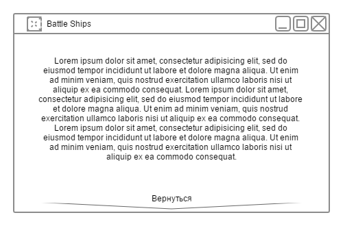
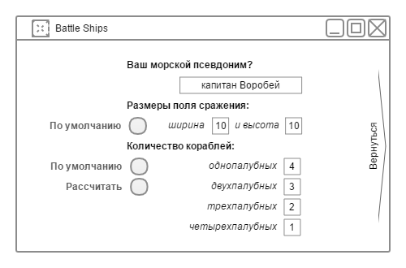
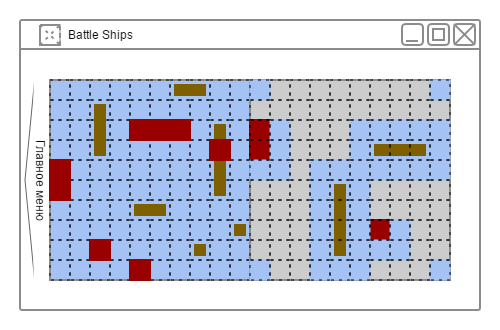

Игра
====

При запуске приложения первое, что видит пользователь это окно, рабочая область которого содержит главное меню.
Отсюда у него есть возможность перейти в раздел общих игровых настроек, просмотреть информацию о приложении,
начать новое сражение, а так же (если пользователь не закончил какое-то локальное сражение) он может продолжить его.

Информация о приложении
-----------------------
Перейдя в этот раздел, пользователь видит информацию о разработчиках данного приложения,
их ФИО, почтовый ящик, и роль в разработке. Находясь в этом разделе, пользователь,
может вернуться назад.

Настройки
---------
Перейдя в этот раздел, пользователь может изменить настройки приложения, в том числе:

* Ввести свое имя или никнейм
* Определеить размеры поля (отдельно горизональное и вертикальное количество секторов в поле);
> * Пользователь не должен иметь возможности задать чрезмерно большие или чрезмерно маленькие размеры поля;
> * Рядом с областью настроек размеров поля есть кнопка, нажатие на которую установит размеры по умолчанию;
* Определить количество кораблей каждого типа;
> * Приложение умеет расчитывать приближенное к валидному количество кораблей.
И не позволяет установить значения значительно отличающиеся от валидных, для заданных размеров поля;
> * Рядом с областью определения количества кораблей есть кнопка,
нажатие на которую установит количество кораблей по умолчанию;
> * Рядом с областью определения количества кораблей есть кнопка,
нажатие на которую расчитает и подставит оптимальное количество кораблей каждого типа для заданных
размеров поля.

Новое сражение
--------------
Описание отсутствует.

Тренировочное сражение
----------------------
Описание отсутствует.

Сражение с рельным игроком
--------------------------
Описание отсутствует.

Вступить в существующее сражение
--------------------------------
Описание отсутствует.

Объявить новое сражение
-----------------------
Описание отсутствует.

Продолжить последнее
--------------------
Описание отсутствует.

