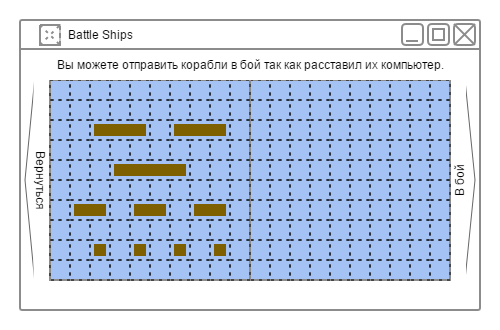
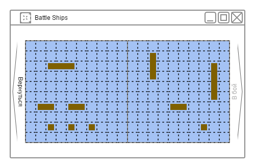
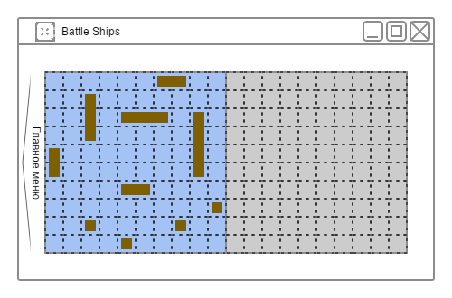
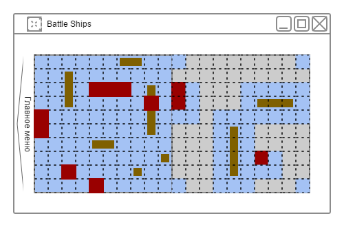
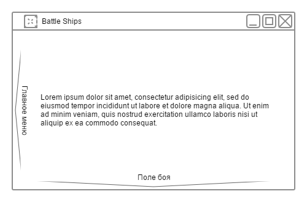

Сражение
========

Весь раунд можно условно разбить на несколько этапов, описанных ниже.
После подготовительного этапа игроки по очереди совершают выстрел,
пока все корабли у одного из игроков не будут потоплены.

Начало раунда
-------------

Когда начинается новый раунд, в рабочей области пользователь видит два поля:
поле доступных кораблей (слева) и поле, на которое он должен расставить эти корабли (справа).

Корабли на левом поле расставляются случайным образом согласно правилам расстановки кораблей.
У пользователя есть возможность воспользоваться этим размещением,
и заполнить правое поле точно таким же образом, нажав на кнопку `В бой`.
После нажатия на эту кнопку все корабли займут позиции, и следующий этап `Расстановка кораблей` будет пропущен. 

Расстановка кораблей
--------------------

Пользователь выбирает корабль на левом поле и отмечает секторы,
которые этот корабль займет на правом поле. При этом он не может выбрать секторы,
которые по правилам игры не могут быть заняты одним кораблем:
секторы не являются соседними друг к другу, или секторы попадает в зону влияния другого корабля.

Когда пользователь выбрал сектор, у него есть возможность отменить указанный сектор. 

Когда количество секторов достаточно для выбранного корабля,
корабль перемещается из левого в правое поле и переставить его невозможно.
С момента установки первого корабля воспользоваться автоматической расстановкой не возможно.

Начало боя
----------

Когда пользователь разместил все доступные ему корабли,
левое поле сдвигается влево и исчезает из области видимости, правое поле занимает место левого,
а на место правого поля приходит третье поле, которое представляет собой область противника.
Все секторы в этом поле скрыты от пользователя "пеленой тумана".

Бой
---

Пользователь выбирает сектор из правого поля,
по которому хочет произвести выстрел, при этом он не может выбрать сектор,
выстрел по которому уже производился или в ходе сражения уже было выяснено,
что в этом секторе не может стоять корабль, так как он попадает под область влияния другого корабля.

* Если результат попадания промах - сектор перекрашивается в цвет моря.
* Если результат попадания ранение - сектор окрашивается в цвет огня.
* Если результат попадания гибель корабля - вместо секторов обозначенных огнем рисуется корабль,
а так же вычисляются секторы попадающие под область влияния этого корабля - все эти секторы окрашиваются в цвет моря.

Конец боя
---------

Когда все корабли одного из игроков потоплены, сражение считается оконченным.
Вся область стражения сдвигается вниз, пока не исчезнет из вида.
Вместо этого пользователю отображается сообщение об окончании раунда.
При этом в рабочей области пояляются управляющие элементы:

* Кнопка `Вернуться в меню` отображается только при игре с компьютером.
При нажатии на нее игра запомнит текущее состояние сражения и вернется в меню.
Это состояние стражения будет существовать в памяти до тех, пор пока не будет закончена
или не будет начата новая игра с компьютером.
* Кнопка `Поле боя`. Предоставляет возможность рассмотреть поле боя еще раз.
Чтобы можно было изучить его подробнее.

В зависимости от того кто победил отображается разное сообщение.

* В случае если победил игрок, отображается сообщение с поздравлением о его победе, количеством ходов,
которые потребовались ему для победы и процентным соотношением попаданий к проигрышам. Например:
> Капитан Воробей, мы победили! Просто невероятно как вы умудрились победить капитана Норингтона всего за 48 выстрелов,
2 из пяти выстрелов в цель. Правду о Вас говорят.

* В случае если победил оппонент, пользователю отображается сообщение о том, что игра окончена и он побежден. Например: 
> Капитан Воробей, флот разбит, боюсь капитан Норингтон оказался не так прост как кажется. 
Возможно нам стоит изучить поле сражения, чтобы подумать о том, как победить его в следующий раз.

